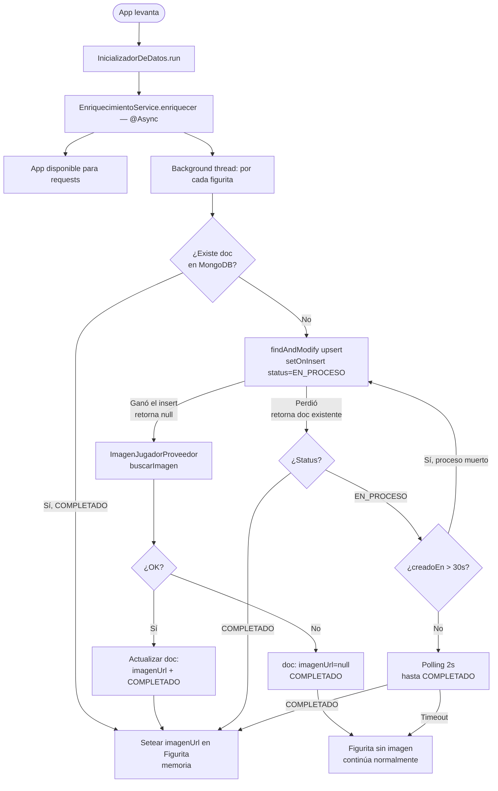
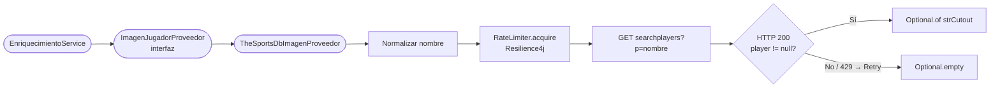
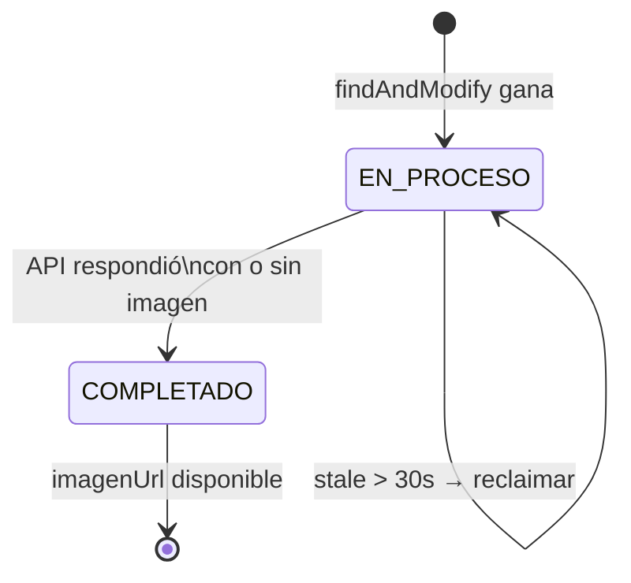

# Plan: Enriquecimiento de Imágenes de Jugadores

## Contexto

Las figuritas del sistema tienen datos básicos (nombre, posición, selección) pero no imagen.
TheSportsDB expone un endpoint público (`searchplayers`) que devuelve una URL de imagen PNG
por jugador (`strCutout`). El objetivo es poblar esa imagen una única vez y persistirla en
MongoDB para no depender del servicio externo en runtime.

---

## Decisiones de diseño

### 1. Solo `strCutout` desde `searchplayers`

El endpoint `searchplayers?p={nombre}` devuelve `strCutout` (PNG recortado sin fondo) en una
sola llamada. Los demás campos de interés (`strDescriptionES`, `strEquipment` de equipo) no
están disponibles en el free tier o no tienen utilidad inmediata en las vistas actuales.

> **Decisión**: 1 llamada HTTP por jugador, solo se persiste `imagenUrl`.

---

### 2. Patrón Adapter — desacoplamiento del proveedor externo

El servicio de enriquecimiento no conoce TheSportsDB directamente. Depende de una interfaz
`ImagenJugadorProveedor` que puede tener múltiples implementaciones:

```
EnriquecimientoService
    └── ImagenJugadorProveedor  (interfaz)
            └── TheSportsDbImagenProveedor  (implementación actual)
            └── OtroProveedorImagenProveedor  (futura migración)
```

Si mañana se cambia de API, solo se crea una nueva clase que implemente la interfaz.
`EnriquecimientoService` no necesita modificarse.

> **Decisión**: interfaz `ImagenJugadorProveedor` con método `Optional<String> buscarImagen(String nombre)`.

---

### 3. Rate limiter y retry — Resilience4j

Resilience4j resuelve dos problemas en un mismo ecosistema:

- **RateLimiter**: controla que no se superen los 30rpm del free tier
- **Retry**: si la API devuelve 429, espera y reintenta automáticamente

Se eligió sobre Guava (no tiene retry) y sobre `Thread.sleep` (no maneja 429).

> **Decisión**: `resilience4j-spring-boot-starter` con RateLimiter (0.5 req/s) + Retry (backoff en 429).

**Nota sobre múltiples instancias**: Resilience4j es in-process. Con N instancias simultáneas
el rate combinado puede exceder 30rpm. La coordinación MongoDB (ver punto 5) reduce el impacto
porque cada jugador solo es procesado por una instancia. El Retry cubre los 429 residuales.
La solución distribuida real requeriría Bucket4j + Redis, descartada por complejidad en este contexto.

---

### 4. Enriquecimiento asíncrono — `@Async`

El enriquecimiento no bloquea el startup. La app levanta inmediatamente y un background thread
enriquece jugadores de a poco. Los clientes que consultan durante el proceso ven `imagenUrl: null`
(frontend muestra placeholder) y progresivamente van viendo las imágenes a medida que se cargan.

```
t=0s   App lista → GET /figuritas → Messi: null, Mbappé: null
t=10s             → GET /figuritas → Messi: "https://...", Mbappé: null
t=30s             → GET /figuritas → todos con imagen ✓
```

> **Decisión**: `EnriquecimientoService.enriquecer()` anotado con `@Async`. La app queda disponible
> de inmediato. `@EnableAsync` en la clase de configuración.

---

### 5. Persistencia en MongoDB — colección dedicada

Los repositorios actuales son en memoria. En lugar de migrar todo el modelo, se agrega una
colección exclusiva de enriquecimiento:

```
player_enrichment: { figuritaId, imagenUrl, status, creadoEn }
```

Al arrancar, cada instancia consulta esta colección primero. Solo llama a la API si el
documento no existe o está en estado `VENCIDO`.

> **Decisión**: colección separada para no acoplar el enriquecimiento al modelo de dominio.

---

### 6. Coordinación entre instancias — MongoDB atomic findAndModify

Con múltiples instancias arrancando simultáneamente, sin coordinación ambas llamarían a la API
para el mismo jugador. Se resuelve con una operación atómica de MongoDB:

- `findAndModify` con `upsert=true` y `$setOnInsert`: solo una instancia crea el documento.
- La que gana (recibe `null`) llama a la API y actualiza `status=COMPLETADO`.
- La que pierde (recibe el documento existente) hace polling hasta `COMPLETADO`.

Se eligió este enfoque por sobre un distributed lock con Redis para no agregar infraestructura
al stack.

> **Decisión**: coordinación vía MongoDB atómico. Redis queda descartado para este caso.

---

### 7. Detección de procesos muertos (stale timeout)

Si la instancia que ganó el claim se cae mientras llama a la API, el documento queda en
`EN_PROCESO` indefinidamente. Solución: se guarda `creadoEn` en el documento. Si una instancia
detecta `EN_PROCESO` con más de 30 segundos de antigüedad, reclaima el documento y reintenta.

> **Decisión**: timeout de 30 segundos configurable en `application.properties`.

---

### 8. Thread safety — `volatile`

El background thread escribe `figurita.setImagenUrl(url)` mientras threads de request leen
`figurita.getImagenUrl()` concurrentemente. El campo se declara `volatile` para garantizar
visibilidad inmediata entre threads sin necesidad de sincronización explícita.

> **Decisión**: `private volatile String imagenUrl` en `Figurita`.

---

### 9. Normalización del nombre del jugador

El parámetro `p` de la API requiere el nombre en minúsculas con guiones bajos y sin caracteres
especiales. La transformación es:

1. NFD decomposition (separa caracteres base de sus diacríticos)
2. Strip de combining characters (elimina tildes, umlauts, etc.)
3. Lowercase
4. Reemplazo de espacios por `_`

Ejemplos: `"Di María"` → `"di_maria"` · `"Mbappé"` → `"mbappe"` · `"Éder Militão"` → `"eder_militao"`

---

## Arquitectura — archivos nuevos y modificados

### Nuevos

| Archivo | Responsabilidad |
|---|---|
| `app/client/ImagenJugadorProveedor.java` | Interfaz del adapter — desacopla el proveedor |
| `app/client/TheSportsDbImagenProveedor.java` | Implementación HTTP + Resilience4j |
| `app/client/dto/TheSportsDbResponse.java` | Deserialización de la respuesta |
| `app/client/dto/TheSportsDbPlayerDto.java` | Campo `strCutout` |
| `app/model/entities/PlayerEnrichment.java` | Documento MongoDB |
| `app/repositories/MongoEnriquecimientoRepository.java` | Acceso a colección |
| `app/servicios/impl/EnriquecimientoService.java` | Orquesta MongoDB + proveedor |
| `app/config/AsyncConfig.java` | `@EnableAsync` + ThreadPoolTaskExecutor |

### Modificados

| Archivo | Cambio |
|---|---|
| `Figurita.java` | Agregar campo `volatile String imagenUrl` |
| `FiguritaIntercambiableDto.java` | Exponer `imagenUrl` |
| `InicializadorDeDatos.java` | Inyectar `EnriquecimientoService`, llamarlo async al final |
| `pom.xml` | Agregar `resilience4j-spring-boot-starter`, `spring-boot-starter-data-mongodb` |
| `application.properties` | URLs, api key, MongoDB URI, timeouts |
| `README.md` | Actualizar contrato del endpoint afectado |

---

## Diagrama de flujo

### Startup



### Adapter — ImagenJugadorProveedor



### Estado del documento MongoDB



---

## Tests

| Test | Tipo | Qué verifica |
|---|---|---|
| `TheSportsDbImagenProveedorTest` | Unit | Happy path, no encontrado, 429 con retry, error HTTP |
| `NombreNormalizadorTest` | Unit | Tildes, umlauts, espacios, casos edge |
| `EnriquecimientoServiceTest` | Unit (mock) | Usa MongoDB si existe, llama proveedor si no, maneja stale, setea imagenUrl en Figurita |

---

## Configuración

```properties
# TheSportsDB
thesportsdb.base-url=https://www.thesportsdb.com/api/v1/json
thesportsdb.api-key=123

# Resilience4j - RateLimiter
resilience4j.ratelimiter.instances.thesportsdb.limit-for-period=1
resilience4j.ratelimiter.instances.thesportsdb.limit-refresh-period=2s
resilience4j.ratelimiter.instances.thesportsdb.timeout-duration=5s

# Resilience4j - Retry
resilience4j.retry.instances.thesportsdb.max-attempts=3
resilience4j.retry.instances.thesportsdb.wait-duration=60s
resilience4j.retry.instances.thesportsdb.retry-exceptions=app.exceptions.RateLimitException

# Enrichment
enrichment.stale-timeout-seconds=30
enrichment.poll-interval-ms=2000
enrichment.poll-max-attempts=20
```

---

## Consideraciones futuras (fuera de scope)

- Imagen de camiseta por selección (`strEquipment` de `searchteams`) — requiere API key paga
- Refresh periódico de imágenes (los jugadores cambian de equipo)
- Rate limiter distribuido con Bucket4j + Redis para entornos con muchas instancias
- Migración de repositorios a MongoDB para unificar persistencia
